# SIGLIp Vision Transformer: Implementation from Scratch

## <span style="color: green">  1. JUPYTER NOTEBOOK RUNNING NOTES </span>
### 1.1 Author's(freeCodeCamp's) original implementation of the SIGLIP : Vision Transformer 
The original implementation of this code is from freeCodeCamp.org. Refer to the following video and code. \
https://www.youtube.com/watch?v=4XgDdxpXHEQ \
https://colab.research.google.com/drive/1Q6bfCG5UZ7ypBWft9auptcD4Pz5zQQQb?usp=sharing#scrollTo=1EaWO-aNOk3v \
A copy of the original notebook can also be found in the folder **original_author_solution**

### 1.2 Krithika's Implementation of the SIGLIP: Vision Transformer
For a step by step implementation of the Vision Transformer i.e broken down into embeddings, single head attention, multi head attention, encoder layers etc refer to the notebooks in the folder **ksw_solution**. \
<span style="color: blue"> **vit_step4_entire_Vit.ipynb:** </span> This is the complete implementation of the siglip: vision transformer \
Note : Every notebook in the ksw_solution folder can be run independently. They have been tested to run error free.

## <span style="color: green">  2. SIGLIP VISION TRANSFORMER </span>
### 2.1 Siglip: High Level Overview
At the highest level this consists of three blocks( the input and output are not really blocks)
- **i)  Input:** Input Image in Pixels. This is fed to the Embeddings layer
- **ii) Embeddings-SiglipEmbeddings:** : Consist of Patch and Position Embeddings
- **iii) Encoder-SiglipEncoder:** Series connection of Single Encoder Layers. Each Single Encoder Layer consists of 2 Layer Norms, 1 Self Attention (Multi Head Attention block) and 1 MLP block
- **iv) Post Layer Norm:**
- **v) Output:** Output image
A Full Siglip: Vision Transformer Architecture Diagram can be found at the end of the Readme.
The Embeddings and Encoder block consist of a number of smaller building blocks which will be described in the following sections. 

### 2.2 Code Notes
Throughout the code and discussion. 
- hidden_size = embedding_size (refers to embeddings)
- num_hidden_layers = num_encoder_layers (got nothing to do with embeddings. Refers to the number of Single Encoder Layers that make up the Encoder block)
- hidden_states are the intermediate and final outputs of the Single Encoder Layers : SiglipEncoder (hidden_states got nothing to do with embeddings)
- The Multi-Head-Attention(Self Attention) : is a **parallel concatenation** of single head attention heads
- The Encoder : is a **series connection** of Single Encoder Layers


## <span style="color: green"> 3. INPUT IMAGE + PREPROCESS IMAGE </span>
The model cannot accept the image as is. It has to be preprocessed to a form that the Siglip Vit can accept it
```
    preprocess = transforms.Compose([
        transforms.Resize((image_size, image_size)),
        transforms.ToTensor(),
        transforms.Normalize(
            mean=[0.485, 0.456, 0.406],
            std =[0.229, 0.224, 0.225]
        )
    ])
```
- It has to be resized to 224x224
- It has to be converted to a tensor
- It has to be normalized: these numbers come from the Imagenet dataset (industry standard)
- Unsqueeze the tensor to include the batch dimension so that the transformer model can use it . When only one image is being used in the batch, batch dimension is 1. (3,224,224) --> unsqueeze -->(1,3,224,224)

## <span style="color: green"> 4. EMBEDDINGS: SiglipEmbeddings </span>
### <span style="color: blue"> 4.1 Embeddings: Overview </span>
The image is coverted to embeddings. All the information in the image is captured by embeddings.

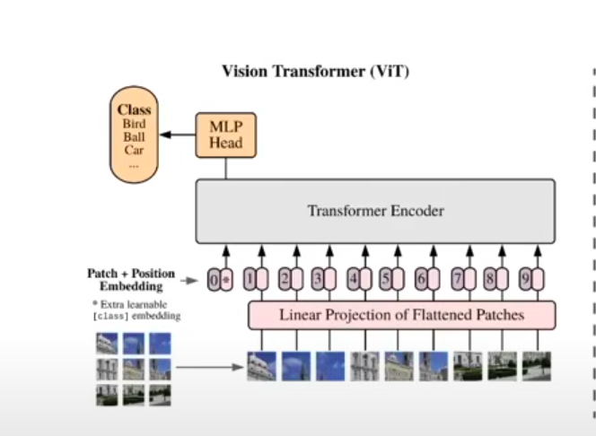

**Code**
```

# Embedding parameters. These are the parameters used by PaliGemma2 model
# embed_dim means that each patch will be converted to a vector of dimension = 768 (that is the embedding output)
embed_dim = 768 
patch_size = 16
image_size = 224
num_patches = (image_size // patch_size)**2

```

### <span style="color: blue"> 4.2 Patch Embeddings </span>
This is the <u>output</u> of a big Conv2d filter.Patch Embeddings are not the Conv2d filter itself, even though in the code , the Conv filter and the embeddings could be interchangeably named . 

- **Input:**  The image tensor is the input. Rather patches from the image tensor is the input. Remember patches are just cutting the image into n*n regions . 


- **Patch Embedding Layer:** This is a Conv2d filter.   In the Conv2d filter kernel_size = patch_size. Example for a image that you decide to divide into patches each with 16x16 pixels. Patch size=16(pixels), Kernel_size = 16 (so you move it over by the entire patch dimension).\
The number of output_channels = embedding_size or hidden_size = 768. \
So total number of patches = image_size/patch_size = 224/16 = 14. 14 along height. 14 along width. total_num_patches = 14x14 = 196 


- **Output/ Patch Embeddings:** The patch embeddings are the output of the conv2d filter. here are 14x14 patches. The number of output channels is a 768. So the patch embeddings is a 14*14*768 square output.\
Then these patch embeddings are flattened out. So the 14*14 square becomes a 196 element vector , where each vector has dimension of 768.


In the diagram above,  the **Flattened Patch Embeddings are the Light Pink Oval** structures (first of which has an asterisk). These are the ouput of the **"Linear Projection of Flattened Patches Block" (in light pink).** The length of each light pink oval is 768. There are 196 such light pink ovals which will be added with respective the **Wine Pink Position Embedding Ovals** (which are also 768 length vector each and a total count of 196 such vectors).

**Question:** Intutively what are Patch Embeddings ? \
**Answer:** Patch Embeddings are essentially image patches convolved using a 16*16 , 768 channel convolution filter. So patch embeddings are the image information converted to a feature space (as learnt by the conv filters.) What do convolution filters do ?. They learn features about images. Thats what this conv2d filter is doing as well. It is learning features about the image and those become patch embeddings

**Question:** How are the patch embeddings learnt / trained ? . \
How are the weights of the Patch Embedding Layer: Conv2d filter learnt. \
**Answer:** To find out. 

See <span style="color: blue"> **vit_step1_img_prepocess_embeddings.ipynb** </span> for code that goes with the above explanation

**Code**
```
## Patch embedding

with torch.no_grad():
    '''
    torch.no grad means we are not going to update the weights of the convolution filter.
    A nn.conv2d filter with random weights has been created. 
    The patch embeddings using this filter will be calculated.
    '''
    # i) input = image_tensor
    input = image_tensor
    # ii) layer = patch_embedding_filter
    # This is like a mini __init__
    patch_embedding_filter = nn.Conv2d(in_channels =3,
                                out_channels= embed_dim,
                                kernel_size = patch_size,
                                stride = patch_size)
    # iii) output = patch_embeddings
    # This one is a like a mini forward    
    patch_embeddings = patch_embedding_filter(input)

# Flatten the patches
# After flattening (1, embed_dim , num_patches) = (1,768,196)
flattened_patch_embeddings = patch_embeddings.flatten(start_dim =2, end_dim =-1)
# (1,768,196) -> (1,196,768) = (1, num_patches, embed_dim) 
flattened_patch_embeddings = flattened_patch_embeddings.transpose(1,2)

print("------ PATCH EMBEDDINGS -------")
print(" The following would show there are 14 patches on the height & 14 on the width.\
Each patch has been converted to a vector of 768. \
Total number of patches = 14x14 = 196 \n")
print("num_patches   =", num_patches)
print("i)   input : image_tensor.shape : ", image_tensor.shape)
print("ii)  layer : patch_embedding_filter  :", patch_embedding_filter)
print("iii) output: patch_embeddings.shape : ", patch_embeddings.shape)
print("iii) output: flattened_patch_embeddings.shape : ", flattened_patch_embeddings.shape)

```

**Code Output**
```
------ PATCH EMBEDDINGS -------
 The following would show there are 14 patches on the height & 14 on the width.Each patch has been converted to a vector of 768. Total number of patches = 14x14 = 196 

num_patches   = 196
i)   input : image_tensor.shape :  torch.Size([1, 3, 224, 224])
ii)  layer : patch_embedding_filter  : Conv2d(3, 768, kernel_size=(16, 16), stride=(16, 16))
iii) output: patch_embeddings.shape :  torch.Size([1, 768, 14, 14])
iii) output: flattened_patch_embeddings.shape :  torch.Size([1, 196, 768])
```


### <span style="color: blue"> 4.3 Position Embeddings </span>  
This is the <u>output</u> of the nn.Embedding layer. Position Embeddings are not the embedding layer itself, even though in the code , the embedding layer and the position embeddings could be interchangeably named . 

- **Input:**  Notice that the input to the module is <u>not the image_tensor , but rather a list of indices or the position ids </u>. 

- **Position Embedding Layer:** This is a nn.Embedding layer. \
nn. Embedding is a simple lookup table that stores embeddings of a fixed dictionary and size. The input to the module is not the image_tensor , but rather a list of indices or the position ids. When you initialize it first the output word embeddings are going to be random. But once trained the output will be a more meaningful position embedding
- num_embeddings (int) – size of the dictionary of embeddings (like 196)
- embedding_dim (int) – the size of each embedding vector. So each of the embeddings how big they are. In this case 768

- **Output/ Patch Embeddings:** The position embeddings are the output of the nn.Embedding layer or the lookup table.  

In the diagram above,  the **Position Embeddings are the Wine Pink Oval** structures which are numbered from 1 to 9. Only 9 of the 196 vectors are shown.  The 196 such wine pink ovals which will be added with respective the **Light Pink Patch Embedding Ovals** (which are also 768 length vectors each and a total count of 196 such vectors).

**Question:** Intutively what are Position Embeddings ? \
**Answer:** This video gives a very good explanation: https://www.youtube.com/watch?v=1biZfFLPRSY \
 Patch Embeddings are vectors that cause small displacements in the Patch Embeddings so that the image patch can be placed in the right location in the embedding space. 
 - Recall that the input was just a bunch of position ids and there was no image_tensor involved. So these are small magnitude vectors that displace the patch embeddings (They have to be by requirement small). In the diagram below , the small magnitude positiong embedding vectors are shown in white. The patch embedding vectors are in green.
 - each vector has the same number of elements as the position embedding vector = 768 . (This is also a requirement)
 - there would be 196 position emebedding vectors to add with the corresponding patch embedding vectors.
 - they tell what is the position of the patch, first or second or what. \
 Based on the paper "Attention is all you Need", you can use Fourier anaylysis. i.e.you can use sines and cosines of varying frequencies because sines and cosines are be default small from -1 to 1 . By varying the frequencies of the sines and cosines you can get enough variation in the values even for large vector sizes example 768 vector length for 196 such vectors.\
 For Example. The first element of the 768 vector, you could use a sine of frequency x, the second spot could use a cosine of frequency of 2x and the third spot a sine of frequency 3x and so and so forth. 
 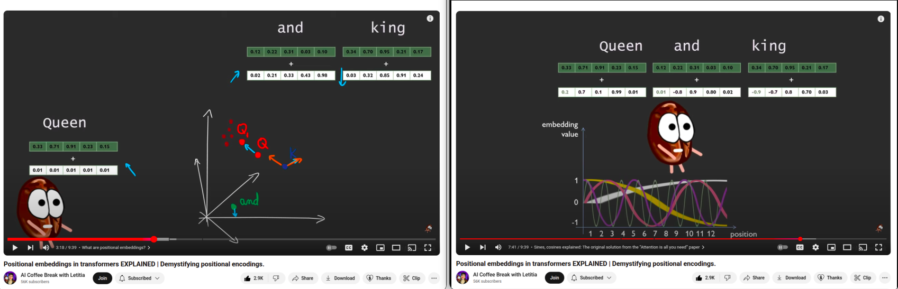

**Question:** How are the position embeddings learnt / trained ? \
**Answer:** The learning is likely learning the frequencies of the sines and cosines ?? To find out details. 

**Code**
```
## Position Embeddings
'''
Find out why torch.no_grad() is not used here ?. 
'''

# i) input = position_ids. 
# Notice that there is no image_tensor involved for position_embeddings. 
# Its just a lookup based on input position ids.
# the expand((1,-1)) just means expand it by the batch dimension so that the transformer can use it
position_ids = torch.arange(num_patches).expand((1,-1))
input = position_ids
# ii) layer = position_embedding_lookup 
position_embedding_lookup = nn.Embedding(num_patches, embed_dim)
# iii) output = position_embeddings
position_embeddings = position_embedding_lookup(position_ids)

print("\n------ POSITION EMBEDDINGS -------")
print("i)   input : position_ids.shape : ", position_ids.shape)
print("ii)  layer : position_embedding_lookup :", position_embedding_lookup)
print("iii) output: position_embeddings.shape : ", position_embeddings.shape)
print("\n")
print("i)   input : the list of position_ids \n", position_ids)

```

**Code Output**
```
------ POSITION EMBEDDINGS -------
i)   input : position_ids.shape :  torch.Size([1, 196])
ii)  layer : position_embedding_lookup : Embedding(196, 768)
iii) output: position_embeddings.shape :  torch.Size([1, 196, 768])


i)   input : the list of position_ids 
 tensor([[  0,   1,   2,   3,   4,   5,   6,   7,   8,   9,  10,  11,  12,  13,
          14,  15,  16,  17,  18,  19,  20,  21,  22,  23,  24,  25,  26,  27,
          28,  29,  30,  31,  32,  33,  34,  35,  36,  37,  38,  39,  40,  41,
          42,  43,  44,  45,  46,  47,  48,  49,  50,  51,  52,  53,  54,  55,
          56,  57,  58,  59,  60,  61,  62,  63,  64,  65,  66,  67,  68,  69,
          70,  71,  72,  73,  74,  75,  76,  77,  78,  79,  80,  81,  82,  83,
          84,  85,  86,  87,  88,  89,  90,  91,  92,  93,  94,  95,  96,  97,
          98,  99, 100, 101, 102, 103, 104, 105, 106, 107, 108, 109, 110, 111,
         112, 113, 114, 115, 116, 117, 118, 119, 120, 121, 122, 123, 124, 125,
         126, 127, 128, 129, 130, 131, 132, 133, 134, 135, 136, 137, 138, 139,
         140, 141, 142, 143, 144, 145, 146, 147, 148, 149, 150, 151, 152, 153,
         154, 155, 156, 157, 158, 159, 160, 161, 162, 163, 164, 165, 166, 167,
         168, 169, 170, 171, 172, 173, 174, 175, 176, 177, 178, 179, 180, 181,
         182, 183, 184, 185, 186, 187, 188, 189, 190, 191, 192, 193, 194, 195]])

```

### <span style="color: blue"> 4.4 Total Embeddings </span> 
Add the flattened patch embeddings and position embeddings. \
This will be the input to the First Single Encoder Layer of the Encoder Block

**Code**
```
## Total Embeddings
embeddings = flattened_patch_embeddings + position_embeddings
print("\n------ BOTH EMBEDDINGS : patch and position embeddings -------")
print("embeddings.shape :", embeddings.shape)

```

**Code Output**
```
------ BOTH EMBEDDINGS : patch and position embeddings -------
embeddings.shape : torch.Size([1, 196, 768])
```

### <span style="color: blue">  4.5 Visualise Embeddings </span> 
See **vit_step1_img_prepocess_embeddings.ipynb** for visualization of Embeddings before and after Training.

#### <span style="color: blue"> 4.5.1 Visualize Embeddings: Before Training </span> 
- Patch embeddings are the output of a nn.Conv2d Filter , the weights have been randomly initialized. They have not been trained
- Position embeddings are the output of a nn.Embedding lookup table, which is in randomly initialized as well. It is not trained. 
- Hence the Patch Embeddings, Position Embeddings and the total Embeddings are not trained.\
Because of this Patch Embeddings and Position Embeddings output should all look random
- Notice that the total_embeddings look pretty similar to the patch embeddings , despite adding the position_embeddings.This is likely because position_embeddings are supposed to be small displacement vectors. And, that the change they have caused is not visible in such a visualization

#### <span style="color: blue"> 4.5.2 Visualize Embeddings: After Training </span>  
- Its not that the  nn.Conv2d Filter , and nn.Embedding lookup table used to create untrained patch and position embeddings respectively have been trained. i.e. there is no model training or embeddings training step in **vit_step1_img_prepocess_embeddings.ipynb**
- Instead download the pre-trained SiglipVisionModel from Hugging face . Visualize the trained embeddings from this model
- Notice that even in the trained model, the total_embeddings look pretty similar to the patch embeddings . This is despite adding the position_embeddings.This is likely because position_embeddings are supposed to be small displacement vectors. And, that the change they have caused is not visible in such a visualization

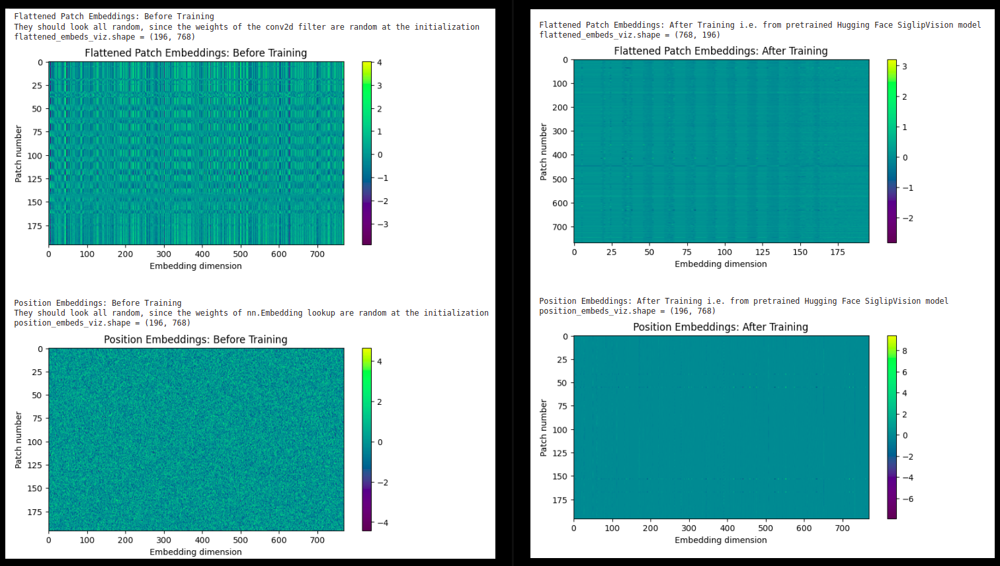
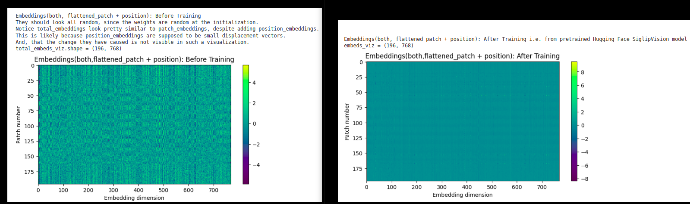


## <span style="color: green">  5. ATTENTION </span>
### <span style="color: blue">  5.1 Attention Formula, and Single Head of Attention </span>

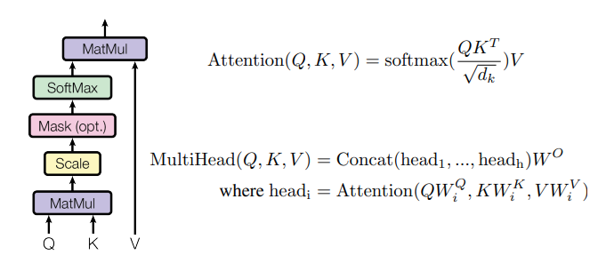

My Notes
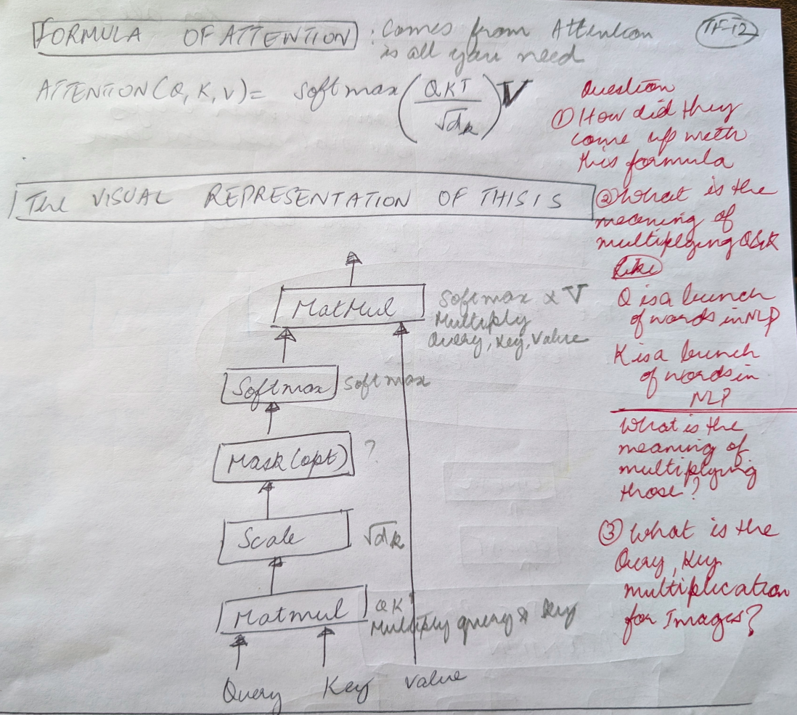

### <span style="color: blue">  5.2 Query, Key, Value Generation for Images </span>
- Query, Key and Values are the core components of Self Attention. 
- At a high level of understanding, each embedding i.e. in this case each of the 196 total_embeddings will emit 3 vectors : query , key and value (the embeddings will pass through the layer norm first though in the siglip transformer encoder, if we have to get into the weeds).
- Query and Key generate the similarity score. 
- The similarity score acts as the attention weights , used to weight the Value vectors, ultimately determining how much attention each element receives from other elements in the sequence. 
 
**Question:** How are Query, Key, Values generated for Images ? \
**Answer:** These are just a bunch of linear layers (that are learnt ??). Multiply the image(actually in case of Siglip:Vit architecture, you multiply the output of the layernorm1 in the SingleEncoderLayer. Not the image itself) with these linear layers and then the output is Q, K and V.

**Question:** How are these linear layers learnt / trained ? \
**Answer:** To find out. 

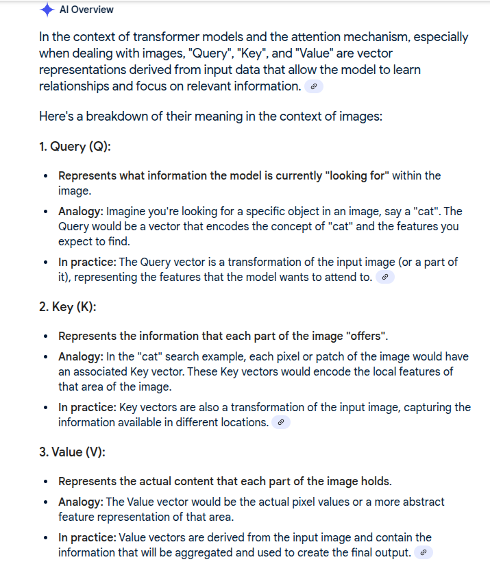 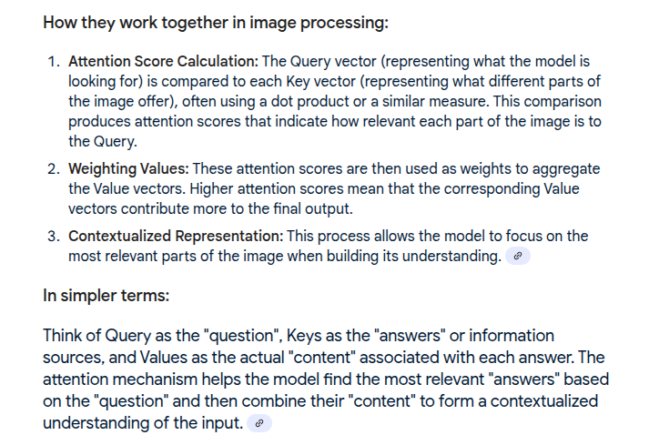

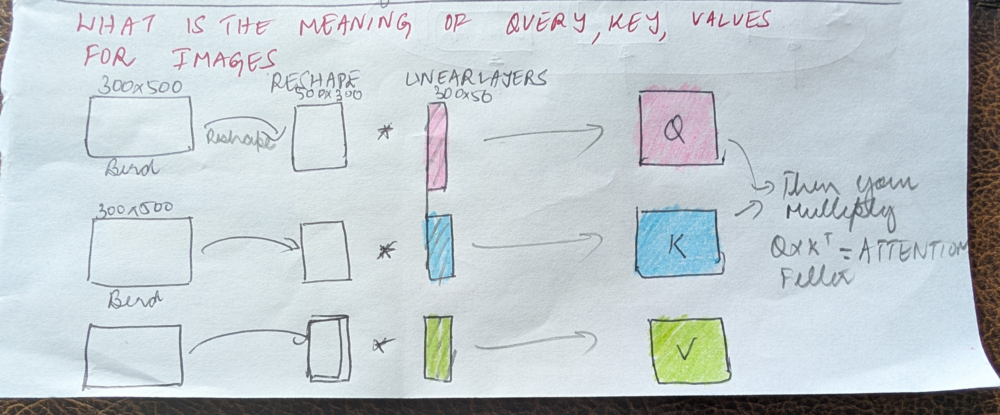

### <span style="color: blue">  5.3 Attention Filter, Scale (dk), and Raw Attention Score </span>
**Attention filter:** Product of Q and K \
**Scale Dk:** number of pixels along either the rows or column ( because of the Q*K-transpose multiplication, I suppose the output will always be a square. So #ofrows= #ofcolumns.\
This scale is needed to prevent the dot product from growing too large. Think of it as a type of normalization. \
**Raw Attention Score/ Similarity Score/ Scaled Attention Filter:** The scaled attention filter i.e attention_filter/sqrt(dk) is called Raw Attention Score. Notice that attention score is calculated using Query and Key only. Since the query and key vectors are compared using a dot product, this raw attetnion score determines their similarity. 

### <span style="color: blue">  5.4 Softmax & Attention Weights. </span>
**Softmax:** Turns the raw scores into probabilities. The softmax transforms the similarity score into attention weights , ensuring the weights sum to 1. 

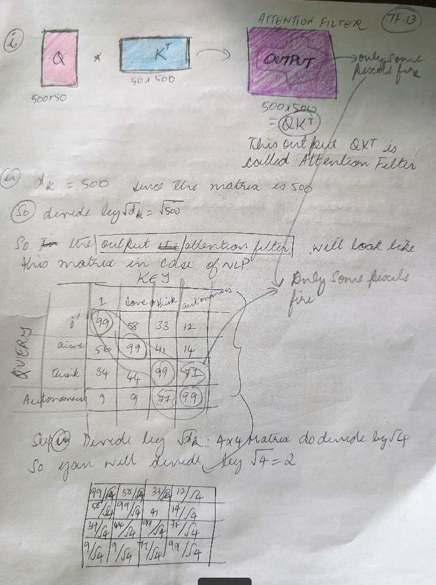

### <span style="color: blue">  5.5 Single Head Attention Output Weighted Sum </span>
- attention = softmax(attention_filter/sqrt(dk))*V. 
- softmax(attention_filter/sqrt(dk)) provides the weights. So the attention itself is a weighted sum of the Values. 
- V is a vector. Softmax is also a vector output of probabilities. So this is also a dot product of two vectors. 
- in the total weighted sum(attention), the combination of highest softmax probability and highest elements of V will be the greatest contributors.
- the weighted sum allows information flow between tokens(patches)

### <span style="color: blue">  5.6 Single Head Attention  </span>
Single head attention consists of all the Q, K, V multiplications , scaling and softmax discussed above. \
Q, K, V in the Siglip: ViT are generated from the layernorm1 output in the respective "single encoder layer"

### <span style="color: blue">  5.7 Multi Head Attention </span>
This is a **PARALLEL CONCATENATION** of single head attention blocks, with a a linear layer at the end.\
- The input to this is the output of the Layernorm1
- Since it is a parallel concatenation of Single Attention Heads, the same layernorm1 output feeds into **all** the single head attention modules (in a given single encoder layer) as input. **So Q, K, V in every single attention head are generated from the same layernorm1 output of that respective single encoder layer**. \
See Full Siglip: Vision Transformer Architecture Diagram for clarity \
Also see below simplified encoder diagram where a 3 pointed arrow goes from the LayerNorm1 (Shown in yellow, to the Green Multi Head Attention) 

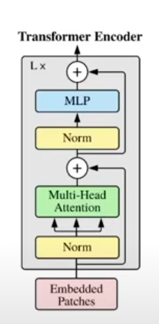

\
In the multi head attention diagram below. \
IMO . 
- **Input:** The input should not be Q, K, V. It should be the input image instead (or a transpose of it perhaps).
- **Q, K, V:** Q, K, V are the values that come after the linear layers (the ones marked with Q?. K?, V?) 

If you are finding it confusing to associate the diagram on top with the diagram below (i.e associating the concatenation of single attention heads). 
- **Linear layers of Q:** Think of these as a Stack-Q of 10 books(these 10 books are not interconnected). 
- **Linear layers of K:** Think of these as a Stack-K of 10 books(these 10 books are not interconnected).
- **Linear layers of V:** Think of these as a Stack-V of 10 books(these 10 books are not interconnected). 
- **Scaled-Dot-Product-Attention rectangles:** Similarly think of these as a Stack-Attention of 10 books. (these 10 books are are not interconnected either. Atleast not yet.) Inside each of these rectangles , the multiplication of Q,K, V, scaling by Dk and softmax happens(from the respective Q, K, V modules)
- the respective Books 1 of Stack-Q, Stack-K, Stack-V feed into Book 1 of Stack-Attention. Inside this Attention block the single head Attention i.e Attention1 = softmax(attention_filter/sqrt(dk))*V is calculated
- the respective Books 2 of Stack-Q, Stack-K, Stack-V feed into Book 2 of Stack-Attention. Inside this Attention block the single head Attention i.e Attention2 = softmax(attention_filter/sqrt(dk))*V is calculated.
- and so on and so forth until....
- the respective books 10 of Stack-Q, Stack-K, Stack-V feed into Book 10 of Stack-Attention. Inside this Attention block the single head Attention i.e Attention10 = softmax(attention_filter/sqrt(dk))*V is calculated.
- **Concat:** The concat block concatenates Attention1, Attention2... all th way to Attention10
- **Final Linear Layer(s):** This remaps the output to an image of desired or original size Example 500*50 etc. (Check if this is accurate ??)
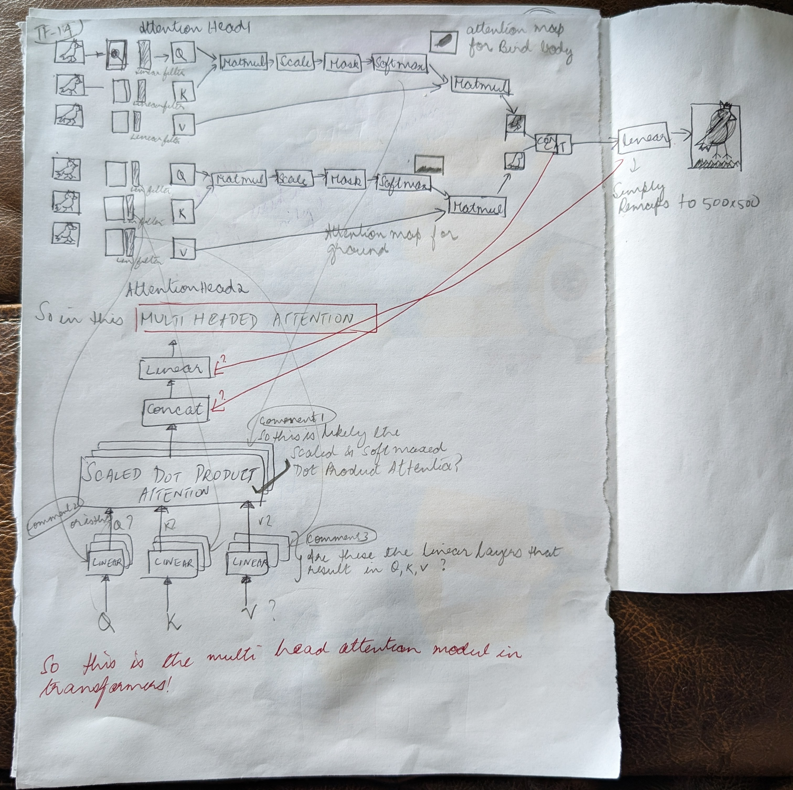


## <span style="color: green">  6. VECTORIZED IMPLEMENTATION OF MULTI HEAD ATTENTION: SiglipAttention </span>
- Vectorized implementation of Multi head attention. Same implementation as Hugging Face (different from the non vectorized implementation in vit_step3 Head and MultiHeadAttention classes)
- You don't have Single Attention Heads. You process all single attention heads parallely
- This is more memory efficient
- This enables using Hugging Face's pretrained weights in our model

#### 6.1 Vectorized Implementation: Overview
In the vectorized implementation there might seem to be a lot of transposes, shape changes etc. \
Here is a high leve overview of it. 
- i)   q, k, v_states are the same dimensions as hidden_states = [1,196,768] = [batch, num_patches, embedding_dimension] 
- ii)  split q,k,v_states into 12 attention heads, along the embedding_dimension (768)  = [1,196,12,64]
- iii) transpose q,k, v_states so that its [batch, num_heads] first and then [196,64] for vectorized multiplication
- iv)  attention filter = q*k_transpose is a square: [1,12, 196,196]
- v)   scaled attention filter, softmax, dropout are all the same square = [1,12,196,196]
- vi)  mutltiply attention_weights*v and the dimesion is back to : [ 1, 12, 196,64]
- vii) transpose attention again so that [12,64] the embeddind dimensions are back together for the concatenation: [ 1,196,12,64]
- viii) Concatenate: merge 12 attention heads to get back the embedding dimension 768=12*64: [1. 196, 768]
- ix)   Project back to residual states shape(which happens to be the same): [1,196,768]


#### 6.2 Evolution of Tensor Sizes in Vectorized Implementation
** Code Output **

```
-----------SiglipAttention: forward details-------------
----------------------------------------------------------------------------------------------------------
Notice the dimensions at each stage to understand the vectorized implementation of multi head attention
----------------------------------------------------------------------------------------------------------
B (batch)              : 1
T (#tokens = #patches) : 196
C (embed_dim)          : 768


-------------------------------------------------------------------------------------------------
q_states, k_states, v_states: output of the linear layers
-------------------------------------------------------------------------------------------------
q_states.shape = torch.Size([1, 196, 768])
k_states.shape = torch.Size([1, 196, 768])
v_states.shape = torch.Size([1, 196, 768])


-------------------------------------------------------------------------------------------------
q_states, k_states, v_states: After splitting 768 to 12 attention heads
-------------------------------------------------------------------------------------------------
q_states.shape = torch.Size([1, 196, 12, 64])
k_states.shape = torch.Size([1, 196, 12, 64])
v_states.shape = torch.Size([1, 196, 12, 64])


-------------------------------------------------------------------------------------------------
q_states, k_states, v_states: transpose for easy vectorized dotproduct(mat-mul)
so that first 2 dimensions are [batch_size, num_heads] = [1,12]
last 2 dimensions are [num_patches, embed_dim/num_heads]= [196,64]
-------------------------------------------------------------------------------------------------
q_states.shape = torch.Size([1, 12, 196, 64])
k_states.shape = torch.Size([1, 12, 196, 64])
v_states.shape = torch.Size([1, 12, 196, 64])


-------------------------------------------------------------------------------------------------
Scale is the embedding dimension per single attention head = 768/12 = 64
Note: in the dk scale diagram in the Readme.md (section 5.4) ,         
 - you multiply [500,50] x[50,500] and the scale dk = 500.         
   dk = 500 seems to be #of patches instead of the embedding size .(This could have been a mistake)         
 - But here in the code, you multiply [196,64] x[64,196] for the attention filter.         
  dk = 64 = embedding dimension. I think embedding dimension makes more sense
-------------------------------------------------------------------------------------------------
dk: scale =  64


-------------------------------------------------------------------------------------------------
 In all the below cases attn: shape is a square i.e 196*196)
-------------------------------------------------------------------------------------------------
i)  attn.shape: scaled attention filter    :  torch.Size([1, 12, 196, 196])


----------------------------------------------------------------------------------------------------------------
Apply softmax. Since attn is [196, 196] it makes no sense to normalize for the entire square 
Apply softmax to get probability distribution along dim -1 = dim 1. This means across the columns i.e. rowwise
----------------------------------------------------------------------------------------------------------------
ii)  attn.shape: after softmax              :  torch.Size([1, 12, 196, 196])
iii) attn.shape: after dropout              :  torch.Size([1, 12, 196, 196])


-------------------------------------------------------------------------------------------------
Multiply attn with v_states. Attention is back to [196,64]
-------------------------------------------------------------------------------------------------
iv) attn.shape: mult with v_states         :  torch.Size([1, 12, 196, 64])


-------------------------------------------------------------------------------------------------
Transpose it back to the original q_states view where [12,64] are the end
[12,64] can be easily multiplied to recover the original embed_dim = 768
-------------------------------------------------------------------------------------------------
v) attn.shape: after transpose            :  torch.Size([1, 196, 12, 64])


-------------------------------------------------------------------------------------------------
Concatenate 12 attention heads so that [12x64] = 768
-------------------------------------------------------------------------------------------------
vi) attn.shape: after reshaping to B, T, C :  torch.Size([1, 196, 768])
vii) attn.shape: after out_proj             :  torch.Size([1, 196, 768])


------- End of SiglipAttention: Forward -------------- 

```

## <span style="color: green">  7. MLP(Multi Layer Perception): SiglipMLP  </span>
This is just a bunch of linear layers to map the hidden state to some other output dimension
Since the intermediate size is quite large at 3072 , you can learn more complex relations , at a higher dimension
- **FC1:** fully connected layer 1
- **gelu: tanh**
- **FC2:** fully connected layer 2.

A block diagram of this can be found in the Full Siglip: Vision Transformer Architecture Diagram


## <span style="color: green">  8. ENCODER: SiglipEncoder </span>
### <span style="color: blue">  8.1 Single Encoder Layer: SiglipEncoderLayer </span>
Consists of the
- **Layer Norm1**
- **Self Attention module (multi attention head)**
- **Residual Addition:
- **Layer Norm1**
- **Self Attention Module(Multi Head Attention)**
- **Residual Addition:** After Layer Norm1 and Self Attention Module (Multi Head Attention)
- **Layer Norm2**
- **MLP Layer**
- **Residual Addition:** After Layer Norm2 and MLP

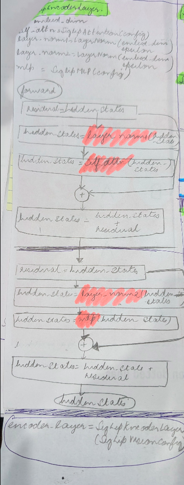


### <span style="color: blue">  8.2 Encoder: SiglipEncoder </span>
- The Encoder is series connection of several Single Encoder Layers: SiglipEncoderLayer. 
- The input to the SiglipEncoder and hence to the first SiglipEncoderLayer is the total_embeddings from the SiglipEmbedding module (this is the hidden_states input to the SiglipEncoderLayer #1)
- The input to the second, third, .....last SiglipEncoderLayer is the output of the respective previous SiglipEncoderLayer.
- The output of SiglipEncoder is the output(hidden_states) of the last SiglipEncoderLayer 
- See **Siglip: Vision Transformer Architecture Diagram**

## <span style="color: green">  9. POST NORM LAYER </span>
- This is the last layer of the Siglip: Vision Transformer
- The input to this is the output of the SiglipEncoder(hidden_states from the last SingleEncoderLayer within the Encoder)
- The output of this post layer norm is the output of the Siglip: Vision Transformer/ Vision Model itself
 
## <span style="color: green">  10. SIGLIP: VISION TRANSFORMER ARCHITECTURE DIAGRAM </span>
### <span style="color: blue"> 10.1 Highlevel: Siglip Vision Transformer Diagram </span>
Encoder on the right. Full Siglip Vit on the right
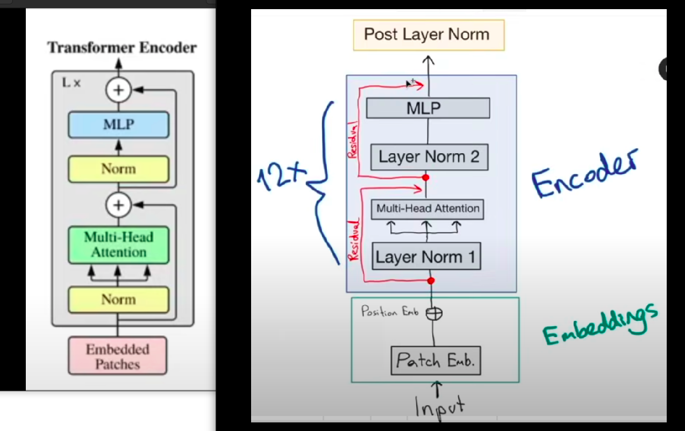

### <span style="color: blue"> 10.2 Detailed: Siglip Vision Transformer Diagram </span>
